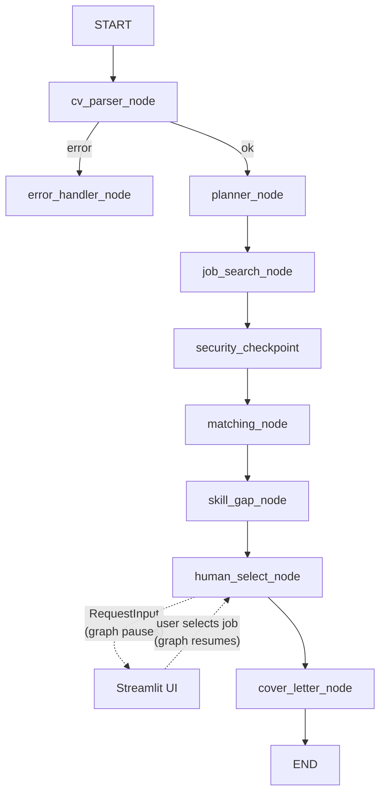
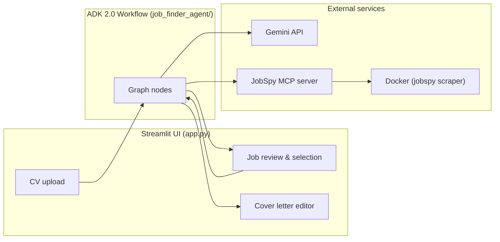

# CareerPilot

An autonomous job-search agent that finds your best-fit roles, analyses skill gaps, and drafts a tailored cover letter in one workflow. Built for the [Kaggle 5-Day AI Agents: Intensive Vibe Coding Course With Google](https://www.kaggle.com/competitions/vibecoding-agents-capstone-project/overview) (Concierge Agents track) using **Antigravity**, **Google ADK 2.0**, **MCP**, and a **Streamlit** human-in-the-loop UI.

---

## The Problem

Job hunting is broken not because jobs are scarce, but because the process is noisy and manual:

- Candidates open multiple job boards, copy-paste their CV into each site, and scroll through hundreds of irrelevant listings.
- Understanding where your skills match (and where they fall short) requires reading every posting in detail.
- Writing a compelling, honest cover letter for each role is time-consuming and repetitive.

The real bottleneck is **signal vs. noise**: too much friction between a person and the handful of roles they should actually apply to. A chatbot that answers job questions cannot solve this, it cannot search live listings, score them against a specific background, pause for a human decision, and then generate something personalised in one unbroken workflow.

---


## The Solution

CareerPilot is an **agent**, not a chatbot. It reasons, uses tools, takes actions, and hands control back to the human at exactly the right moment.


| Capability        | How CareerPilot addresses it                                                                                                      |
| ----------------- | --------------------------------------------------------------------------------------------------------------------------------- |
| **Live data**     | Searches LinkedIn, Indeed, and others via the [JobSpy MCP server](https://github.com/borgius/jobspy-mcp-server)                   |
| **Judgment**      | Hybrid Python + LLM scoring, per-job skill-gap analysis, and a fail-closed security checkpoint before any posting reaches a model |
| **Human control** | The graph **pauses** after ranking — a cover letter is only drafted after *you* select one job                                    |


**End-to-end flow:** upload a CV PDF → parse skills → search live listings → scrub and validate postings → score and rank matches → analyse skill gaps → **you pick a role** → receive a tailored cover-letter draft (250–400 words, honest about gaps, no fabricated matches).

---


## Architecture

CareerPilot is implemented as an **ADK 2.0** `Workflow` **graph** — eight function nodes wired by edges, with one conditional error branch and a `RequestInput` pause for human-in-the-loop (HITL) selection.

### Graph workflow




### System components




### Design principles

- **Python owns routing and arithmetic**: scoring baselines, PII redaction, prompt-injection heuristics, and word-count enforcement run in deterministic Python, not in the LLM.
- **Fail-closed security**:  every scraped posting passes through a security checkpoint *before* any LLM call. Flagged postings are excluded; the model never sees unsanitised text.
- **Spec-driven development**: each node was defined first in Gherkin-style specs under `specs/`, then implemented and validated against sample outputs.
- **HITL via** `RequestInput`: the graph suspends at `human_select_node` and resumes only when the user submits a job selection through the Streamlit UI.


### Node descriptions


| Node                    | Role                                                                                                                                                  |
| ----------------------- | ----------------------------------------------------------------------------------------------------------------------------------------------------- |
| **cv_parser_node**      | Extracts structured skills, titles, and experience from raw PDF bytes (deterministic text extraction + one focused LLM call for skill normalisation). |
| **planner_node**        | Derives search parameters from the parsed CV; pure Python, no LLM.                                                                                    |
| **job_search_node**     | Calls the JobSpy MCP server to fetch recent listings from multiple platforms.                                                                         |
| **security_checkpoint** | Scrubs PII (emails, phones, addresses) and detects prompt-injection patterns. Fail-closed: flagged postings never reach an LLM.                       |
| **matching_node**       | Hybrid scorer; Python keyword-overlap baseline plus batched LLM seniority/fit adjustment. Results ranked 0–100.                                       |
| **skill_gap_node**      | Per-job analysis (matched vs. missing skills) on the top *N* postings only.                                                                           |
| **human_select_node**   | HITL pause using ADK 2.0 `RequestInput`. Graph suspends until the user picks exactly one job.                                                         |
| **cover_letter_node**   | Generates a single tailored draft for the selected posting, with retry logic and Python word-count enforcement (250–400 words).                       |


### Project structure

```
agy-capstone/
├── app.py                      # Streamlit entry point
├── job_finder_agent/
│   ├── agent.py                # ADK Workflow graph definition
│   ├── config.py               # Thresholds, model name, weights
│   ├── schemas.py              # Pydantic models for all node I/O
│   ├── nodes/                  # One file per graph node
│   ├── mcp_servers/            # JobSpy MCP client wrapper
│   ├── ui/                     # Streamlit components and styles
│   └── tests/
├── jobspy-mcp-server/          # Vendored JobSpy MCP server (Node.js)
├── specs/                      # Gherkin specs per node
└── .agents/skills/             # Agent Skills for scaffolding and validation
```

---


## Tech stack


| Layer           | Technology                                                                                 |
| --------------- | ------------------------------------------------------------------------------------------ |
| Agent framework | [Google ADK 2.0](https://google.github.io/adk-docs/) (`Workflow` graph API)                |
| LLM             | Gemini (`gemini-2.5-flash` by default)                                                     |
| Job search      | [JobSpy MCP server](https://github.com/borgius/jobspy-mcp-server) (Docker-backed scrapers) |
| UI              | Streamlit                                                                                  |
| Validation      | Pydantic schemas + Gherkin specs                                                           |


---


## Prerequisites

- **Python 3.10+** (3.12 recommended)
- **Node.js 16+** (for the JobSpy MCP server)
- **Docker** (JobSpy runs scrapers inside a `jobspy` container)
- **Gemini API key** — create one at [Google AI Studio](https://aistudio.google.com/apikey)

---


## Local setup


### 1. Python dependencies

From the repository root:

```bash
cd job_finder_agent
python -m venv .venv
source .venv/bin/activate   # Windows: .venv\Scripts\activate
pip install -r requirements.txt
cd ..
```

Or with [uv](https://docs.astral.sh/uv/):

```bash
uv venv job_finder_agent/.venv
source job_finder_agent/.venv/bin/activate
uv pip install -r job_finder_agent/requirements.txt
```


### 2. Application environment (repo root)

Copy the example file and set your Gemini key:

```bash
cp .env.example .env
```

Edit `.env` and set at minimum:


| Variable                   | Required | Default                 | Description                                                                |
| -------------------------- | -------- | ----------------------- | -------------------------------------------------------------------------- |
| `GOOGLE_API_KEY`           | **Yes**  | —                       | Gemini API key for CV parsing, matching, skill-gap, and cover-letter nodes |
| `MODEL_NAME`               | No       | `gemini-2.5-flash`      | Model used by all graph LLM nodes                                          |
| `JOBSPY_TRANSPORT`         | No       | `sse`                   | `sse` (HTTP to MCP server) or `stdio` (spawn MCP subprocess)               |
| `JOBSPY_SSE_URL`           | No       | `http://localhost:9423` | MCP server URL when using SSE transport                                    |
| `UI_HIDE_STREAMLIT_CHROME` | No       | off                     | Set to `1` to hide Streamlit header/toolbar for demos                      |


### 3. JobSpy Docker image

Job search invokes Docker to run the scraper. Build the image once:

```bash
docker build -t jobspy jobspy-mcp-server/jobspy
```

The image name must match `JOBSPY_DOCKER_IMAGE` in the MCP server `.env` (default: `jobspy`).

### 4. JobSpy MCP server

The MCP server is vendored in `jobspy-mcp-server/` (see [upstream project](https://github.com/borgius/jobspy-mcp-server)).

```bash
cd jobspy-mcp-server
cp .env.example .env
npm install
```

MCP server variables (in `jobspy-mcp-server/.env`):


| Variable              | Default     | Description                                           |
| --------------------- | ----------- | ----------------------------------------------------- |
| `JOBSPY_DOCKER_IMAGE` | `jobspy`    | Docker image built in step 3                          |
| `JOBSPY_HOST`         | `localhost` | SSE bind address                                      |
| `JOBSPY_PORT`         | `9423`      | SSE port (must match `JOBSPY_SSE_URL` in root `.env`) |
| `ENABLE_SSE`          | `1`         | Required for the app's default SSE transport          |


---


## Running locally

Use **two terminals** from the repository root.

**Terminal 1: MCP server** (keep running):

```bash
cd jobspy-mcp-server
npm start
```

`ENABLE_SSE=1` in `.env` starts the HTTP/SSE server on port 9423.

**Terminal 2: CareerPilot (Streamlit UI)**:

```bash
source job_finder_agent/.venv/bin/activate   # if not already active
streamlit run app.py
```

Open the URL Streamlit prints (typically `http://localhost:8501`). Upload a CV PDF to parse skills, search live listings, score matches, and pause for human review before drafting a cover letter.

### Stdio transport (optional)

To skip the separate MCP HTTP server, set in the repo-root `.env`:

```
JOBSPY_TRANSPORT=stdio
```

The app spawns the MCP server as a subprocess. You still need Node.js, `npm install` in `jobspy-mcp-server/`, and the `jobspy` Docker image.

---


## Specs and development

Node behaviour is defined in Gherkin-style specs before implementation:


| Spec                                                             | Covers                                       |
| ---------------------------------------------------------------- | -------------------------------------------- |
| `[specs/cv-parsing.md](specs/cv-parsing.md)`                     | CV Parser node                               |
| `[specs/security.md](specs/security.md)`                         | Security Checkpoint (PII + prompt injection) |
| `[specs/job-matching-scoring.md](specs/job-matching-scoring.md)` | Matching and Skill Gap nodes                 |
| `[specs/cover-letter.md](specs/cover-letter.md)`                 | Cover Letter node                            |


Agent Skills under `.agents/skills/` scaffold new nodes from a standard template and validate outputs against the spec schemas.

---


## JobSpy MCP Server

Job search is powered by the [JobSpy MCP Server](https://github.com/borgius/jobspy-mcp-server). A copy is included at `jobspy-mcp-server/` for local development.

- **Upstream repository:** [https://github.com/borgius/jobspy-mcp-server](https://github.com/borgius/jobspy-mcp-server)
- **License:** MIT (see upstream repository)

---


## License

See individual component licenses. The JobSpy MCP server is MIT-licensed (upstream).